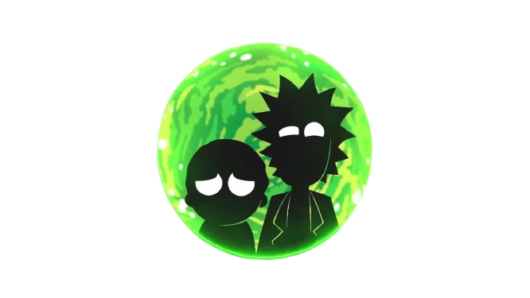
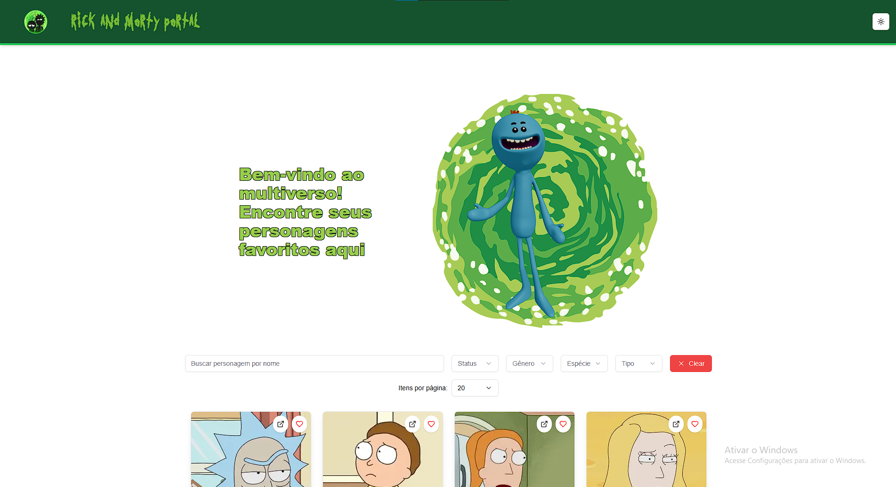

# Projeto: Rick and Morty for Web

<p align="center">


</p>


## Descrição

Aplicação web feita com **Next.js 14**, estilizado com **Tailwind CSS** e componentes do **shadcn/ui**, que consome a **API pública de Rick and Morty**. 

A proposta do projeto é oferecer uma experiência agrádavel para explorar todos os **826 personagens** da série, com paginação totalmente customizável (permitindo exibir 5, 10 ou 20 personagens por vez), filtros dinâmicos por nome, status, gênero, espécie e tipo, e busca em tempo real. A interface é responsiva, visualmente agradável e carrega elementos que remetem ao universo da série, como a tipografia personalizada inspirada em Rick and Morty, ícones do lucide-react e suporte ao modo escuro com next-themes. 

O projeto também utiliza QueryParams no Client Side, garantindo controle total da paginação e dos filtros, mantendo a performance da aplicação.

- API Pública: https://rickandmortyapi.com/

## Como rodar o projeto localmente
1. Clone o repositório
```bash
git clone https://github.com/Felipe-Camargo12/react-test.git
```
2. Acesse a pasta do projeto
```bash
cd rick-morty-portal
```
3. Instale as dependências
```bash
npm install
```
4. Inicie o servidor de desenvolvimento
```bash
npm start
```
Ou inicie o servidor de produção
```bash
npm run build build
next start
```

## 🛠️ Tecnologias utilizadas
- [React 18](https://18.react.dev/)
- [Next.js 14.2.26](https://nextjs.org/docs/14)
- [TypeScript 5](https://www.typescriptlang.org/)
- [Tailwind CSS 3.4.1](https://v3.tailwindcss.com/)
- [shadcn/ui](https://ui.shadcn.com/docs) – biblioteca de componentes modernos e acessíveis
- [lucide-react](https://lucide.dev/) – ícones otimizados para React
- [Fonte Rick and Morty](https://fontswan.com/rick-and-morty-font/) – identidade visual estilizada da série
- [React Three Fiber](https://r3f.docs.pmnd.rs/getting-started/introduction) - renderização de personagem 3d

## Link para acessar o projeto.
Acesse o projeto online:
https://felipe-rick-and-morty.vercel.app/

## Funcionalidades principais 

- Listagem completa dos **826 personagens** da série

  Conforme é setado client-side o número de itens por página, ou seja, [5, 10 ou 20] personagens por vez, o total de páginas deve mudar:

  - 226%20 = 41,3 então: 20 personagens = 42 páginas  
  - 226%10 = 82,6 então: 10 personagens = 83 páginas  
  - 226%5 = 165,2 então: 5 personagens = 166 páginas

- Modal com detalhes completos do personagem ao clicar no card

- UI responsiva e animada com Tailwind e shadcn

- Uso de Suspense para gerenciar QueryParams no Client Side Rendering


**Observação:** QueryParams usado precisa ser encapsulado em Suspense e modularizado em um componente a parte da page.tsx:

 - [QueryParams – Next.js 14](https://nextjs.org/docs/14/app/api-reference/functions/use-search-params)
  - [Missing Suspense – Next.js](https://nextjs.org/docs/messages/missing-suspense-with-csr-bailout)